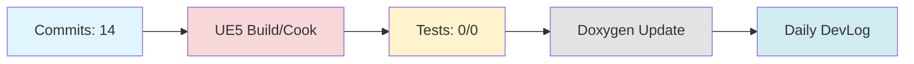

# Daily DevLog — 2025-11-08 (토)

**범위**: 2025-11-07 ~ 2025-11-08
**브랜치**: main / 베이스: origin/main
**릴리즈 타겟**: N/A

---

## 1. 오늘의 핵심 변경 (Top Changes)

- [feat] feat(docs): restructure Documents folder and implement HonKit auto-generation system — 영향: 기능 추가

- [feat] feat: config.yml 중앙 설정 시스템 및 HonKit 빌드 에러 수정 — 영향: 기능 추가

- [fix] fix(honkit): HonKit 빌드 에러 수정 - root 경로를 Documents로 변경 — 영향: 버그 수정

### Commit Heatmap
- 총 커밋: 14
- 변경 라인: +10395 / -2291
- 영향 파일: order_claude.md, Documents/DevLog/AgentLog/dopple/251108.md, .github/workflows/devlog.yml, .github/scripts/devlog/generate_system_review.py, .github/scripts/generate-devlog.js

---

## 2. 시스템 영향도 (Impact)

### 성능

- 로딩: 데이터 없음

### 안정성

- 크래시: 데이터 없음

### 네트워크

- 네트워크: 데이터 없음

---

## 3. 검증 (Verification)

### 빌드 (UE5)

- 빌드 정보 없음

### 테스트

- 테스트 결과 없음

### 정적분석

- 정적분석 결과 없음

---

## 4. 코드 문서화 변화 (Doxygen Delta)

- API 변화 없음

---

## 5. 리팩토링·위험 이슈

### 리팩토링

- 리팩토링 없음

### 위험

- 위험 항목 없음

---

## 6. 내일(Next)·미진(Action)

### Next

- 계획된 작업 없음

### 미진

- 미진 작업 없음

---

## 7. Mermaid 개요도

---

**생성 시간**: 2025-11-08 15:07:01
---

# 🎓 개발자 성장 피드백 (GPT-4 Analysis)

## 🤔 성찰 질문
- HonKit auto-generation 시스템을 도입하면서 얻고자 했던 가장 큰 이점은 무엇인가요?
- 중앙 설정 시스템을 구축하면서 가장 어려웠던 점은 무엇이었나요? 이를 어떻게 해결하셨나요?
- 빌드 에러를 수정하기 위한 과정에서 다른 접근 방법은 무엇이 있을까요?
- 문서 구조를 재구성하면서 향후 유지보수를 위해 고려한 사항은 무엇인가요?
- 테스트 및 검증 단계가 부족한데, 이를 보완하기 위해 어떤 계획을 세울 수 있을까요?

## 💡 대안 제시
- HonKit 빌드 에러를 수정할 때, CI/CD 파이프라인에서 자동으로 경로 문제를 감지하고 알림을 주는 스크립트를 추가하는 방법을 고려해보세요.
- 문서화 자동 생성을 위해 GitHub Actions와 같은 CI 도구를 사용하여 주기적으로 문서를 업데이트하고 검증하는 자동화 프로세스를 구축해보세요.
- 중앙 설정 시스템은 가독성을 높이는 것이 중요합니다. 설정 파일의 구조를 JSON Schema나 YAML Linter를 통해 검증하는 방법을 고려해보세요.

## 📚 학습 포인트
- **HonKit**: 문서 생성 자동화 툴로, GitBook과 유사하지만 JavaScript 기반으로 더 많은 커스터마이징이 가능합니다.
- **CI/CD 파이프라인**: GitHub Actions를 활용하여 문서화, 빌드, 테스트를 자동화하고 안정성을 높일 수 있습니다.
- **정적 분석 도구**: 코드 품질을 높이기 위해 ESLint, Prettier, Flake8 같은 도구를 활용해보세요.
- **중앙 설정 관리**: 다양한 환경에서 설정을 관리하기 위한 YAML, JSON 형식의 활용 및 환경 분리 전략을 학습할 수 있습니다.

## ⚠️ 주의 사항
- 현재 테스트 및 빌드에 대한 정보가 부족합니다. 실제 배포 시의 문제를 사전에 파악하기 위해 다양한 테스트 케이스를 추가하는 것이 중요합니다.
- 문서 경로 및 파일 구조 변경은 다른 서비스와의 연동성에 영향을 줄 수 있으므로, 이를 문서화하고 팀원과 공유하는 것이 필요합니다.
- 빌드 에러 수정은 임시 방편일 가능성이 있으므로, 근본 원인을 추적하고 장기적인 해결책을 모색하세요.

## 🎯 다음 단계 제안
- **테스트 강화**: 자동화된 테스트 케이스를 추가하여 빌드 및 배포의 안정성을 높이세요. 특히 문서화 시스템의 무결성을 확인할 수 있는 테스트를 고려해보세요.
- **문서화 개선**: 새로운 구조로 변경된 문서의 사용자 가이드나 개발자 문서를 작성하여 팀원들이 쉽게 접근할 수 있도록 하세요.
- **정적 분석 도구 활용**: 프로젝트에 적합한 정적 분석 도구를 도입하고, 코드 품질을 지속적으로 모니터링하세요.
- **지속적 배포 환경 구축**: 문서화 및 코드 변경사항이 지속적으로 배포될 수 있는 환경을 구축하여, 사용자에게 항상 최신 정보를 제공할 수 있도록 하세요.

---

*이 피드백은 OpenAI GPT-4를 통해 자동 생성되었습니다. 참고용으로 활용하시고, 최종 판단은 개발자 본인이 내리시기 바랍니다.*
