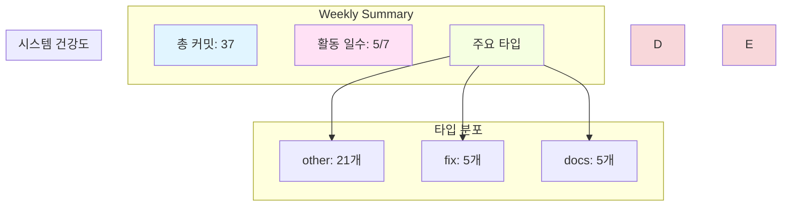

# Weekly DevLog — 2025-W45 (2025-11-03 ~ 2025-11-09)

**주간 요약**: 2개 신규 기능, 5개 버그 수정, 1개 리팩토링

---

## 📊 주간 통계 (Weekly Stats)

### 커밋 활동
- **총 커밋**: 37개
- **변경 라인**: +16399 / -3474
- **활동 일수**: 5/7일
- **주요 작업자**: dopple, Ju100, github-actions[bot]

### 커밋 타입 분포

| 타입 | 개수 | 비율 |
|------|------|------|

| other | 21 | 56.8% |

| fix | 5 | 13.5% |

| docs | 5 | 13.5% |

| chore | 3 | 8.1% |

| feat | 2 | 5.4% |

| refactor | 1 | 2.7% |

### Hotspot 파일 (상위 10개)

| 파일 | 변경 라인 | 변경 빈도 |
|------|-----------|-----------|

| `order_claude.md` | 1144 | 2회 |

| `Documents/Planning/Comprehensive_Competency_Assessment_2025-11-04.md` | 1013 | 1회 |

| `Documents/DevLog/AgentLog/dopple/251108.md` | 659 | 3회 |

| `.github/workflows/devlog.yml` | 646 | 2회 |

| `"Documents/Planning/\354\225\204\353\246\204\353\213\244\354\232\264\354\232\260\353\246\254\352\266\201\352\266\220_\355\232\214\352\263\240.txt"` | 570 | 1회 |

| `.github/scripts/devlog/generate_system_review.py` | 560 | 2회 |

| `.github/scripts/generate-devlog.js` | 518 | 2회 |

| `.git-hooks/prepare-commit-msg` | 472 | 2회 |

| `Documents/DevLog/WORKFLOW_GUIDE.md` | 438 | 2회 |

| `Documents/SUMMARY.md` | 410 | 8회 |

---

## 🎯 주요 성과 (Key Achievements)

### 신규 기능 (Features)

- **feat(docs): restructure Documents folder and implement HonKit auto-generation system**
  - by dopple on 2025-11-08

- **feat: config.yml 중앙 설정 시스템 및 HonKit 빌드 에러 수정**
  - by dopple on 2025-11-08

### 버그 수정 (Fixes)

- **fix(docs): HonKit 네비 오류 수정 및 주간 리포트 보강**
  - by Ju100 on 2025-11-09

- **Fix: Honkit 문서 페이지 밀림 현상 해결**
  - by dopple on 2025-11-09

- **fix(honkit): HonKit 빌드 에러 수정 - root 경로를 Documents로 변경**
  - by dopple on 2025-11-08

- **fix: remove non-existent 'honkit install' command**
  - by dopple on 2025-11-08

- **fix: upgrade Node.js to v20 to resolve HonKit undici File object error**
  - by dopple on 2025-11-08

### 리팩토링 (Refactoring)

- **refactor: DevLog 피드백 시스템 재구축 및 워크플로우 개선**
  - by dopple on 2025-11-08

### 성능 개선 (Performance)

- 이번 주 성능 개선 없음

---

## 📈 시스템 건강도 (System Health)

### 빌드 안정성

- 빌드 데이터 없음

### 테스트 결과

- 테스트 데이터 없음

### 코드 품질

- 정적분석 데이터 없음

---

## 🔥 주목할 변화 (Notable Changes)

### 아키텍처 변화

- 이번 주 아키텍처 변화 없음

### API 변화

- API 변화 없음

---

## 🚧 이슈 및 위험 (Issues & Risks)

### 발견된 이슈

- 발견된 이슈 없음

### 위험 요소

- 위험 요소 없음

---

## 📝 다음 주 계획 (Next Week)

### 우선순위 작업

- TBD

### 기술 부채 해결

- 없음

---

## 💡 회고 및 피드백 (Reflection & Feedback)

### 이번 주 회고 질문

**Q: 이번 주 가장 큰 성과는 무엇이었나요?**

_답변을 작성해주세요:_

---

**Q: 이번 주 2개의 신규 기능을 개발했습니다. 그 중 가장 도전적이었던 기능은 무엇이고, 왜 그랬나요?**

_답변을 작성해주세요:_

---

**Q: 5개의 버그를 수정했습니다. 버그의 근본 원인은 무엇이었고, 재발 방지를 위해 어떤 조치를 취했나요?**

_답변을 작성해주세요:_

---

**Q: 리팩토링을 진행한 이유는 무엇이었고, 코드 품질이 실제로 개선되었나요?**

_답변을 작성해주세요:_

---

**Q: 'order_claude.md' 파일이 가장 많이 변경되었습니다. 이 파일이 자주 변경되는 이유는 무엇이고, 구조 개선이 필요할까요?**

_답변을 작성해주세요:_

---

**Q: 다음 주에 개선하고 싶은 점은 무엇인가요? (기술적/프로세스적)**

_답변을 작성해주세요:_

---

---

## 📊 Mermaid 주간 요약

---

**생성 시간**: 2025-11-08 16:10:26
**Daily Logs**: [2025-11-09](2025-11-09.md) 
---

# 🎓 주간 성장 회고 (GPT-4 Weekly Feedback)

## 🏆 이번 주 성과

1. **신규 기능 구현**: Documents 폴더 재구조화와 HonKit 자동 생성 시스템을 성공적으로 구현한 점은 큰 성과입니다. 이는 문서 관리 효율성을 높이고, 자동화된 시스템을 통해 개발자들이 더 중요한 작업에 집중할 수 있게 합니다.
   
2. **버그 수정**: 총 5개의 버그를 해결하며 HonKit 빌드 오류를 수정하고, Node.js 업그레이드를 통해 undici File 객체 오류를 해결한 점이 인상적입니다. 이러한 버그 수정은 시스템의 안정성을 크게 향상시켰습니다.

3. **리팩토링**: DevLog 피드백 시스템을 재구축하고 워크플로우를 개선하여 코드의 품질과 유지보수성을 높인 점은 장기적으로 큰 가치를 제공합니다.

## 📊 작업 패턴 분석

- **강점**: 주어진 문제를 해결하는 데 집중하면서도 새로운 기능을 도입하는 균형 잡힌 접근이 돋보입니다. 특히, 자동화 시스템 도입과 버그 수정에서의 적극적인 문제 해결 능력이 두드러집니다.
  
- **개선 필요 영역**: 커밋 로그에서 `other` 타입이 많은 비율을 차지하고 있어, 커밋 메시지를 더 구체적이고 명확하게 작성하여 작업 내역을 정확히 파악할 수 있도록 하면 좋겠습니다.

## 🤔 깊이 있는 회고 질문

1. 이번 주 가장 도전적인 기능은 무엇이었고, 왜 그랬나요?
2. 해결한 버그 중 가장 복잡했던 것은 무엇이었고, 해결 과정에서 배운 점은 무엇인가요?
3. 'order_claude.md' 파일의 잦은 변경을 어떻게 줄일 수 있을까요?
4. 리팩토링 과정에서 가장 큰 개선을 이룬 부분은 무엇이며, 그로 인해 얻은 이점은 무엇인가요?
5. 다음 주에 어떤 기술적/프로세스적 개선을 목표로 하시겠습니까?

## 💡 놓쳤을 수 있는 관점

- **테스트 자동화**: 이번 주에 테스트 및 빌드 관련 데이터가 부족했는데, 이 부분에 대한 자동화 및 모니터링 시스템 구축을 고려해보세요. 이는 코드 품질 향상에 큰 도움이 될 것입니다.

## 📚 학습 성장 포인트

- **HonKit 시스템**: HonKit 시스템의 설정과 문제 해결을 통해 문서화 자동화에 대한 깊은 이해를 얻었을 것입니다. 이는 앞으로의 프로젝트에서 유사한 자동화 시스템을 구축하는 데 유용할 것입니다.

## ⚠️ 기술 부채 & 리스크

- **문서화 & 코드 주석**: 문서화와 코드 주석을 강화하여 팀 내 다른 개발자들이 시스템을 이해하고 유지보수할 수 있도록 하는 것이 필요합니다.
  
- **핫스팟 파일**: 'order_claude.md'와 같이 자주 변경되는 파일에 대한 구조 개선이 필요할 수 있습니다. 유지보수 비용을 줄이기 위해 파일 구조나 내용을 재검토하세요.

## 🎯 다음 주 성장 제안

1. **테스트 및 빌드 자동화**: 테스트 커버리지를 높이고, 빌드 자동화를 통해 시스템 안정성을 강화하세요.
   
2. **커밋 메시지 개선**: 커밋 메시지를 더 구체적이고 명확하게 작성하는 연습을 통해 작업 내역 추적성을 높이세요.

3. **문서화 향상**: 이번 주에 구현한 자동화 시스템에 대한 문서화를 강화하여 다른 팀원들도 쉽게 이해하고 활용할 수 있도록 하세요.

4. **핫스팟 파일 구조 개선**: 자주 변경되는 파일에 대한 구조적 개선을 통해 유지보수성을 높이세요.

이러한 피드백을 통해 다음 주에는 더 큰 성장을 기대할 수 있기를 바랍니다!

---

## 📝 회고 작성 가이드

위 피드백을 참고하여 스스로 회고를 작성해보세요:

1. **회고 질문에 답하기**: 각 질문에 대해 솔직하게 답변을 작성하세요
2. **성장 포인트 내재화**: 학습한 내용을 자신의 언어로 정리하세요
3. **다음 주 계획**: 제안된 목표 중 실제로 실행할 것을 선택하고 구체화하세요
4. **팀 공유**: 의미 있는 인사이트는 팀과 공유하세요

---

*이 피드백은 OpenAI GPT-4를 통해 자동 생성되었습니다.*
*피드백을 참고하되, 최종 판단과 회고는 본인이 직접 작성하시기 바랍니다.*
