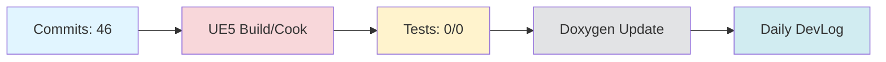

# Daily DevLog — 2025-11-09 (일)

**범위**: 2025-11-08 ~ 2025-11-09
**브랜치**: docs / 베이스: origin/main
**릴리즈 타겟**: N/A

---

## 1. 오늘의 핵심 변경 (Top Changes)

- [feat] feat: docs 브랜치 자동 관리 시스템 구축 — 영향: 기능 추가

- [feat] feat(docs): restructure Documents folder and implement HonKit auto-generation system — 영향: 기능 추가

- [feat] feat: config.yml 중앙 설정 시스템 및 HonKit 빌드 에러 수정 — 영향: 기능 추가

### Commit Heatmap
- 총 커밋: 46
- 변경 라인: +12233 / -2832
- 영향 파일: order_claude.md, Documents/DevLog/AgentLog/dopple/251108.md, .github/workflows/devlog.yml, .github/scripts/devlog/generate_system_review.py, Documents/SUMMARY.md

---

## 2. 시스템 영향도 (Impact)

### 성능

- 로딩: 데이터 없음

### 안정성

- 크래시: 데이터 없음

### 네트워크

- 네트워크: 데이터 없음

---

## 3. 검증 (Verification)

### 빌드 (UE5)

- 빌드 정보 없음

### 테스트

- 테스트 결과 없음

### 정적분석

- 정적분석 결과 없음

---

## 4. 코드 문서화 변화 (Doxygen Delta)

- API 변화 없음

---

## 5. 리팩토링·위험 이슈

### 리팩토링

- 리팩토링 없음

### 위험

- 위험 항목 없음

---

## 6. 내일(Next)·미진(Action)

### Next

- 계획된 작업 없음

### 미진

- 미진 작업 없음

---

## 7. Mermaid 개요도

---

**생성 시간**: 2025-11-09 05:59:35
---

# 🎓 개발자 성장 피드백 (GPT-4 Analysis)

## 🤔 성찰 질문
- 자동 관리 시스템 구축 과정에서 가장 큰 도전 과제는 무엇이었으며, 이를 어떻게 해결했나요?
- 현재 HonKit 자동 생성 시스템이 향후 확장성이나 유지 보수에 어떻게 기여할 수 있을까요?
- config.yml을 중앙 설정 시스템으로 사용하면서 어떤 장점과 단점이 있었나요?
- 왜 빌드, 테스트, 정적 분석 결과가 없는지, 이를 개선하기 위해 어떤 조치를 취할 수 있을까요?
- 문서화 자동화가 프로젝트 전체에 어떤 긍정적 영향을 미칠 것으로 예상하나요?

## 💡 대안 제시
- **테스트 자동화**: 자동 생성 시스템이 잘 작동하는지 검증하기 위해 기본적인 테스트 케이스를 추가하는 것을 고려해보세요. 예를 들어, HonKit 결과물이 예상대로 생성되는지를 확인하는 스크립트를 작성할 수 있습니다.
- **빌드 시스템 통합**: 현재 UE5 빌드 정보가 없는데, CI/CD 파이프라인에 빌드를 통합하여 자동화할 수 있는 방법을 모색해보세요.
- **정적 분석 통합**: 정적 분석 도구를 워크플로우에 통합하여 코드 품질을 지속적으로 모니터링하는 것도 좋은 방법입니다.

## 📚 학습 포인트
- **GitHub Actions**: GitHub Actions를 활용하여 워크플로우를 자동화하고, 다양한 이벤트에 반응하는 방법을 배울 수 있습니다.
- **CI/CD 파이프라인**: 지속적 통합 및 배포 파이프라인을 설계하고 구현하는 데 필요한 요소들을 이해하는 기회가 됩니다.
- **문서화 자동화**: HonKit과 같은 도구를 통해 문서화 작업을 자동화하는 방법과 그 장점에 대해 배울 수 있습니다.
- **중앙 설정 관리**: config.yml 등을 통해 설정을 중앙화하여 관리하는 방법과 그 이점을 학습할 수 있습니다.

## ⚠️ 주의 사항
- **테스트 부족**: 현재 테스트 결과가 없으므로, 시스템의 안정성과 신뢰성을 보장하기 위해 테스트를 추가하는 것이 중요합니다.
- **빌드 실패 위험**: 빌드 정보가 없다는 것은 잠재적으로 빌드 실패를 미리 감지할 수 없다는 것을 의미하므로, 이를 보완할 방법이 필요합니다.
- **기술 부채**: 자동화 시스템이 잘 작동하더라도, 명확한 문서화와 코드 주석을 통해 유지보수성을 높이는 것이 중요합니다.
- **확장성 고려**: 현재 시스템이 증가하는 문서화 요구를 충족할 수 있는지, 확장 가능한 구조로 설계되었는지 검토가 필요합니다.

## 🎯 다음 단계 제안
- **테스트 케이스 작성**: 자동화된 테스트 케이스를 작성하여 시스템의 주요 기능을 검증하고, CI/CD 파이프라인에 통합하세요.
- **빌드 및 배포 자동화**: UE5 빌드 프로세스를 GitHub Actions에 통합하여 자동화 수준을 높이세요.
- **정적 분석 도구 도입**: 코드 품질 향상을 위해 정적 분석 도구를 도입하고, 정기적으로 실행되도록 설정하세요.
- **문서화 개선**: 생성된 문서의 품질과 가독성을 개선하기 위한 피드백 루프를 마련하고, 관련 피드백을 적용하세요.
- **모니터링 및 로깅**: 자동화 시스템의 상태를 모니터링하고, 문제 발생 시 로그를 통해 빠르게 원인을 파악할 수 있도록 하세요.

---

*이 피드백은 OpenAI GPT-4를 통해 자동 생성되었습니다. 참고용으로 활용하시고, 최종 판단은 개발자 본인이 내리시기 바랍니다.*
