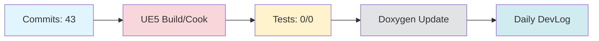

# Daily DevLog — 2025-11-09 (일)

**범위**: 2025-11-08 ~ 2025-11-09
**브랜치**: docs / 베이스: origin/main
**릴리즈 타겟**: N/A

---

## 1. 오늘의 핵심 변경 (Top Changes)

- [feat] feat: docs 브랜치 자동 관리 시스템 구축 — 영향: 기능 추가

- [feat] feat(docs): restructure Documents folder and implement HonKit auto-generation system — 영향: 기능 추가

- [feat] feat: config.yml 중앙 설정 시스템 및 HonKit 빌드 에러 수정 — 영향: 기능 추가

### Commit Heatmap
- 총 커밋: 43
- 변경 라인: +11858 / -2805
- 영향 파일: order_claude.md, Documents/DevLog/AgentLog/dopple/251108.md, .github/workflows/devlog.yml, .github/scripts/devlog/generate_system_review.py, .github/scripts/generate-devlog.js

---

## 2. 시스템 영향도 (Impact)

### 성능

- 로딩: 데이터 없음

### 안정성

- 크래시: 데이터 없음

### 네트워크

- 네트워크: 데이터 없음

---

## 3. 검증 (Verification)

### 빌드 (UE5)

- 빌드 정보 없음

### 테스트

- 테스트 결과 없음

### 정적분석

- 정적분석 결과 없음

---

## 4. 코드 문서화 변화 (Doxygen Delta)

- API 변화 없음

---

## 5. 리팩토링·위험 이슈

### 리팩토링

- 리팩토링 없음

### 위험

- 위험 항목 없음

---

## 6. 내일(Next)·미진(Action)

### Next

- 계획된 작업 없음

### 미진

- 미진 작업 없음

---

## 7. Mermaid 개요도

---

**생성 시간**: 2025-11-09 04:34:34
---

# 🎓 개발자 성장 피드백 (GPT-4 Analysis)

## 🤔 성찰 질문
- 자동 생성 시스템을 구축하면서 가장 어려웠던 부분은 무엇이었나요? 이 문제를 어떻게 해결했나요?
- HonKit 자동 생성 시스템을 구현하면서 NPM 패키지나 다른 도구를 활용할 여지는 없었나요? 
- `config.yml` 설정을 중앙화하면서 어떤 장점과 단점이 있었나요?
- 빌드와 테스트, 정적 분석 관련 검증이 부족한데, 이를 어떻게 개선할 수 있을까요?
- 로그 디렉토리 구조를 개선했는데, 이를 통해 얻고자 했던 궁극적인 목표는 무엇인가요?

## 💡 대안 제시
- **빌드 및 테스트 자동화**: GitHub Actions 등 CI/CD 도구를 사용하여 빌드와 테스트를 자동화함으로써 검증 단계를 강화할 수 있습니다.
- **정적 분석 도구**: ESLint, SonarQube와 같은 정적 분석 도구를 활용하여 코드 품질을 지속적으로 모니터링하는 것을 고려해보세요.
- **문서 자동화**: Doxygen 외에도 문서화를 위한 다른 도구를 비교 분석하여 선택의 폭을 넓힐 수 있습니다. 
- **개발 로그 자동화 개선**: 개발 로그 생성 과정에서 `generate_system_review.py` 스크립트를 개선하여 더 세부적인 데이터 수집 및 분석이 가능하도록 할 수 있습니다.

## 📚 학습 포인트
- **Git 브랜치 전략**: 다양한 브랜치 전략을 통해 협업의 효율성을 높일 수 있는 방법을 학습하세요.
- **CI/CD 기본 개념**: 지속적인 통합과 배포의 중요성과 이를 구현하는 방법에 대한 이해를 심화할 수 있습니다.
- **정적 분석**: 코드 품질을 유지하고 개선하는 데 도움이 되는 정적 분석 기법과 도구에 대해 학습하세요.
- **구성 관리**: 중앙 설정 시스템을 구현하면서 구성 관리의 중요성과 관련 패턴을 배울 수 있습니다.

## ⚠️ 주의 사항
- **테스트 미비**: 빌드 및 테스트 결과가 없으므로, 코드의 정확성과 안정성에 대한 신뢰성을 보장할 수 없습니다.
- **변경 라인 수**: 하루에 너무 많은 변경 라인이 포함될 경우, 코드 리뷰가 어려워지고 버그가 발생할 가능성이 높아집니다.
- **자동화 도구 유지보수**: 자동 생성 시스템과 관련된 스크립트의 유지보수성을 주기적으로 점검해야 합니다.
- **의존성 관리**: HonKit 및 기타 의존성의 버전을 명확히 관리하여 호환성 문제를 방지해야 합니다.

## 🎯 다음 단계 제안
- **테스트 자동화 도입**: 테스트 스크립트를 작성하고 이를 자동화하여 빌드 시 자동으로 실행되도록 설정하세요.
- **코드 리뷰 프로세스 개선**: 코드 리뷰 프로세스를 강화하여 품질을 높이고 협업을 활성화하세요.
- **문서화 강화**: API 문서화의 범위를 확장하여 더 많은 개발자들이 쉽게 이해할 수 있도록 지원하세요.
- **기술 부채 관리**: 현재 진행 중인 작업의 기술 부채를 주기적으로 평가하고 관리할 계획을 수립하세요.
- **성능 측정**: 성능 지표를 설정하고 이를 모니터링하여 시스템의 최적화를 지속적으로 수행하세요.

---

*이 피드백은 OpenAI GPT-4를 통해 자동 생성되었습니다. 참고용으로 활용하시고, 최종 판단은 개발자 본인이 내리시기 바랍니다.*
