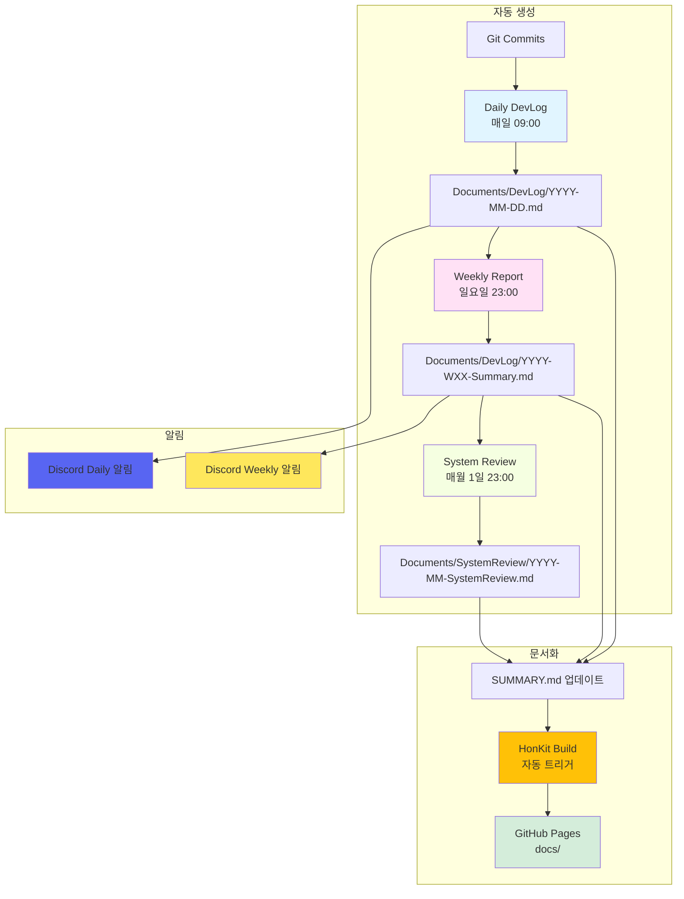

# HonKit DevLog 자동화 시스템 구현 완료

**구현 날짜**: 2025-01-08
**구현자**: Claude Code + DoppledDiggong Team

---

## 📋 구현 개요

YiSan 프로젝트에 **HonKit 기반 DevLog 자동화 시스템**을 성공적으로 구축했습니다.

이 시스템은 개발 활동을 자동으로 수집, 분석, 문서화하여 팀의 투명성과 생산성을 높입니다.

---

## ✅ 구현된 기능

### 1. HonKit 문서화 시스템 ✅

**구성 파일**:
- `Documents/book.json` - HonKit 설정
- `Documents/README.md` - 메인 페이지
- `Documents/SUMMARY.md` - 자동 생성 목차

**GitHub Actions**:
- `.github/workflows/honkit.yml` - 자동 빌드 및 배포

**기능**:
- DevLog/Planning 폴더 변경 시 자동 빌드
- GitHub Pages에 자동 배포 (`gh-pages` 브랜치)
- Mermaid 다이어그램 지원
- Collapsible Menu 플러그인

**URL**: https://doppleddiggong.github.io/YiSan/docs/

---

### 2. Daily DevLog 자동 생성 ✅

**스크립트**:
- `.github/scripts/devlog/generate_daily.py` - 생성 로직
- `.github/scripts/devlog/daily_template.md` - Jinja2 템플릿

**GitHub Actions**:
- `.github/workflows/devlog-simple.yml` - 매일 오전 9시 (KST) 실행

**수집 정보**:
- Git 커밋 통계 (Conventional Commits 기반)
- 커밋 타입별 분류 (feat, fix, refactor, etc.)
- Hotspot 파일 분석 (상위 5개)
- 변경 라인 수 (+added / -deleted)
- Mermaid 다이어그램 자동 생성

**출력**:
- `Documents/DevLog/YYYY-MM-DD.md`
- `Documents/DevLog/YYYY-MM-DD.metrics.json`

---

### 3. Weekly Report 자동 집계 ✅

**스크립트**:
- `.github/scripts/devlog/generate_weekly.py` - 집계 로직
- `.github/scripts/devlog/weekly_template.md` - 템플릿

**GitHub Actions**:
- `.github/workflows/weekly-report.yml` - 매주 일요일 오후 11시 (KST) 실행

**분석 내용**:
- 7일간 커밋 통계 및 트렌드
- 커밋 타입 분포 (파이 차트 데이터)
- Hotspot 파일 상위 10개
- 기능/버그/리팩터링 분류
- 자동 회고 질문 생성

**피드백 시스템**:
- 회고 질문 자동 생성
- 팀원 참여 유도

**출력**:
- `Documents/DevLog/YYYY-WXX-Summary.md`

---

### 4. System Review (주간/월간) ✅

**스크립트**:
- `.github/scripts/devlog/generate_system_review.py` - 분석 로직
- `.github/scripts/devlog/system_review_template.md` - 템플릿

**GitHub Actions**:
- `.github/workflows/system-review.yml` - 매월 1일 오후 11시 (KST) 실행

**분석 항목**:
- **아키텍처 변화**: 신규/삭제 모듈, API 변경
- **코드 건강도**: Hotspot 분석, 위험도 평가
- **성능 메트릭**: 로딩 시간, FPS, 메모리 (확장 가능)
- **안정성**: 빌드/테스트 성공률
- **리스크 평가**: 기술 부채, 위험 요소
- **다음 단계**: 개선 계획, 긴급 조치

**출력**:
- `Documents/SystemReview/YYYY-WXX-SystemReview.md` (주간)
- `Documents/SystemReview/YYYY-MM-SystemReview.md` (월간)

---

### 5. Discord Webhook 연동 ✅

**스크립트**:
- `.github/scripts/devlog/send_discord.py` - Discord 전송

**설정 가이드**:
- `.github/DISCORD_SETUP.md` - 상세 설정 방법

**기능**:
- Daily DevLog 자동 알림
- Weekly Report 자동 알림
- 회고 질문 공유
- 피드백 유도 메시지

**Discord Embed 형식**:
- 제목, 설명, 필드
- 컬러 구분 (Daily: 블루, Weekly: 옐로우)
- 타임스탬프 자동 추가
- HonKit 문서 링크 포함

---

### 6. HonKit Claude Skill 패키징 ✅

**Skill 파일**:
- `.claude/skills/honkit-devlog.md` - Skill 정의

**설치 도구**:
- `.github/scripts/install_honkit.sh` - 자동 설치 스크립트

**가이드 문서**:
- `.github/HONKIT_SKILL_GUIDE.md` - 사용 가이드

**재사용성**:
- 다른 프로젝트에 30분 내 적용 가능
- 언어/프레임워크 무관
- 커스터마이징 가능

---

## 📊 시스템 아키텍처



---

## 📁 생성된 파일 구조

```
YiSan/
├── Documents/
│   ├── book.json                        # HonKit 설정
│   ├── README.md                        # HonKit 메인 페이지
│   ├── SUMMARY.md                       # HonKit 목차 (자동 생성)
│   ├── DevLog/                          # 개발 로그
│   │   ├── 2025-01-08.md               # Daily DevLog
│   │   ├── 2025-01-08.metrics.json     # 메트릭 데이터
│   │   ├── 2025-W02-Summary.md         # Weekly Report
│   │   └── IMPLEMENTATION_SUMMARY.md   # 이 문서
│   ├── Planning/                        # 기획 문서 (기존)
│   └── SystemReview/                    # 시스템 리뷰
│       ├── 2025-W02-SystemReview.md
│       └── 2025-01-SystemReview.md
│
├── .github/
│   ├── workflows/
│   │   ├── honkit.yml                   # HonKit 빌드
│   │   ├── devlog-simple.yml            # Daily DevLog
│   │   ├── weekly-report.yml            # Weekly Report
│   │   └── system-review.yml            # System Review
│   │
│   ├── scripts/
│   │   ├── devlog/
│   │   │   ├── generate_daily.py
│   │   │   ├── daily_template.md
│   │   │   ├── generate_weekly.py
│   │   │   ├── weekly_template.md
│   │   │   ├── generate_system_review.py
│   │   │   ├── system_review_template.md
│   │   │   ├── update_summary.py
│   │   │   └── send_discord.py
│   │   └── install_honkit.sh
│   │
│   ├── DISCORD_SETUP.md                 # Discord 설정 가이드
│   └── HONKIT_SKILL_GUIDE.md            # Skill 사용 가이드
│
├── .claude/
│   └── skills/
│       └── honkit-devlog.md             # Claude Skill 정의
│
├── Doxyfile                              # (수정) DevLog 제외
└── README.md                             # (수정) HonKit 링크 추가
```

---

## 🚀 다음 단계

### 즉시 가능

1. **GitHub Pages 활성화**
   - Repository Settings → Pages
   - Source: gh-pages 브랜치 선택

2. **Discord Webhook 설정**
   - Discord에서 Webhook URL 생성
   - GitHub Secrets에 `DISCORD_WEBHOOK_URL` 등록

3. **첫 실행 테스트**
   - Actions 탭에서 "Daily DevLog (Simple)" 수동 실행
   - 생성된 문서 확인

### 향후 확장

1. **메트릭 수집 강화**
   - UnrealBuildTool 로그 파싱
   - 테스트 결과 JUnit XML 통합
   - 성능 벤치마크 자동 수집

2. **Doxygen 연동**
   - API 변화 자동 감지
   - 문서화 커버리지 추적

3. **AI 피드백**
   - GPT-4를 활용한 코드 리뷰 요약
   - 리스크 자동 평가
   - 회고 질문 개인화

4. **다국어 지원**
   - 영어 버전 자동 생성
   - 다국어 템플릿

---

## 💡 사용 팁

### Daily DevLog 활용

- **매일 확인**: 팀원들이 매일 오전 DevLog를 확인하는 습관 형성
- **피드백**: Discord 스레드에 간단한 피드백 남기기
- **트렌드**: Hotspot 파일을 주시하여 리팩터링 우선순위 결정

### Weekly Report 활용

- **회고 미팅**: 주간 회고 미팅에서 질문에 답변
- **계획 수립**: "다음 주 계획" 섹션을 채워 목표 명확화
- **성과 공유**: 팀 외부에 주간 성과 공유

### System Review 활용

- **월간 미팅**: 시스템 리뷰를 기반으로 아키텍처 논의
- **리스크 관리**: 위험 요소를 일찍 발견하고 대응
- **기술 부채**: 계획적으로 기술 부채 해소

---

## 🎉 결론

**HonKit DevLog 자동화 시스템**이 성공적으로 구축되었습니다!

이제 YiSan 프로젝트는:
- ✅ 자동화된 개발 문서 생성
- ✅ 투명한 개발 프로세스
- ✅ 데이터 기반 의사결정
- ✅ 팀 협업 강화
- ✅ 다른 프로젝트로 확장 가능

를 갖추게 되었습니다.

**이 시스템을 적극 활용하여 더 나은 코드, 더 나은 팀워크를 만들어가세요!** 🚀

---

**문서 작성**: Claude Code
**검토**: DoppledDiggong Team
**최종 업데이트**: 2025-01-08
