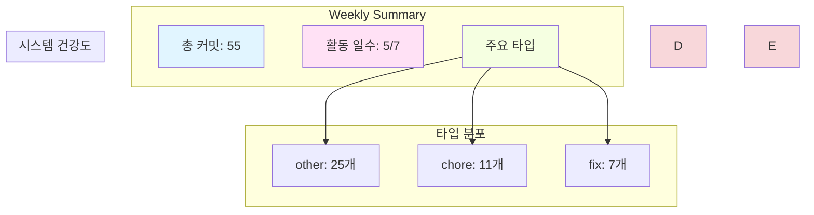

# Weekly DevLog — 2025-W45 (2025-11-03 ~ 2025-11-09)

**주간 요약**: 3개 신규 기능, 7개 버그 수정, 3개 리팩토링

---

## 📊 주간 통계 (Weekly Stats)

### 커밋 활동
- **총 커밋**: 55개
- **변경 라인**: +17360 / -3879
- **활동 일수**: 5/7일
- **주요 작업자**: dopple, Ju100, github-actions[bot]

### 커밋 타입 분포

| 타입 | 개수 | 비율 |
|------|------|------|

| other | 25 | 45.5% |

| chore | 11 | 20.0% |

| fix | 7 | 12.7% |

| docs | 6 | 10.9% |

| refactor | 3 | 5.5% |

| feat | 3 | 5.5% |

### Hotspot 파일 (상위 10개)

| 파일 | 변경 라인 | 변경 빈도 |
|------|-----------|-----------|

| `order_claude.md` | 1144 | 2회 |

| `Documents/Planning/Comprehensive_Competency_Assessment_2025-11-04.md` | 1013 | 1회 |

| `Documents/DevLog/AgentLog/dopple/251108.md` | 787 | 4회 |

| `.github/workflows/devlog.yml` | 646 | 2회 |

| `"Documents/Planning/\354\225\204\353\246\204\353\213\244\354\232\264\354\232\260\353\246\254\352\266\201\352\266\220_\355\232\214\352\263\240.txt"` | 570 | 1회 |

| `.github/scripts/devlog/generate_system_review.py` | 560 | 2회 |

| `Documents/SUMMARY.md` | 547 | 10회 |

| `.github/scripts/generate-devlog.js` | 518 | 2회 |

| `Documents/DevLog/2025-11-09.md` | 482 | 4회 |

| `.git-hooks/prepare-commit-msg` | 472 | 2회 |

---

## 🎯 주요 성과 (Key Achievements)

### 신규 기능 (Features)

- **feat: docs 브랜치 자동 관리 시스템 구축**
  - by dopple on 2025-11-09

- **feat(docs): restructure Documents folder and implement HonKit auto-generation system**
  - by dopple on 2025-11-08

- **feat: config.yml 중앙 설정 시스템 및 HonKit 빌드 에러 수정**
  - by dopple on 2025-11-08

### 버그 수정 (Fixes)

- **fix(workflows): trigger HonKit build after DevLog generation**
  - by dopple on 2025-11-09

- **fix: 게스트 클라이언트의 중복 로딩 프로세스 방지**
  - by dopple on 2025-11-09

- **fix(docs): HonKit 네비 오류 수정 및 주간 리포트 보강**
  - by Ju100 on 2025-11-09

- **Fix: Honkit 문서 페이지 밀림 현상 해결**
  - by dopple on 2025-11-09

- **fix(honkit): HonKit 빌드 에러 수정 - root 경로를 Documents로 변경**
  - by dopple on 2025-11-08

- **fix: remove non-existent 'honkit install' command**
  - by dopple on 2025-11-08

- **fix: upgrade Node.js to v20 to resolve HonKit undici File object error**
  - by dopple on 2025-11-08

### 리팩토링 (Refactoring)

- **refactor(workflows): simplify DevLog workflows by executing directly on docs branch**
  - by dopple on 2025-11-09

- **refactor(devlog): 로그 파일 디렉토리 구조 개선**
  - by dopple on 2025-11-09

- **refactor: DevLog 피드백 시스템 재구축 및 워크플로우 개선**
  - by dopple on 2025-11-08

### 성능 개선 (Performance)

- 이번 주 성능 개선 없음

---

## 📈 시스템 건강도 (System Health)

### 빌드 안정성

- 빌드 데이터 없음

### 테스트 결과

- 테스트 데이터 없음

### 코드 품질

- 정적분석 데이터 없음

---

## 🔥 주목할 변화 (Notable Changes)

### 아키텍처 변화

- 이번 주 아키텍처 변화 없음

### API 변화

- API 변화 없음

---

## 🚧 이슈 및 위험 (Issues & Risks)

### 발견된 이슈

- 발견된 이슈 없음

### 위험 요소

- 위험 요소 없음

---

## 📝 다음 주 계획 (Next Week)

### 우선순위 작업

- TBD

### 기술 부채 해결

- 없음

---

## 💡 회고 및 피드백 (Reflection & Feedback)

### 이번 주 회고 질문

**Q: 이번 주 가장 큰 성과는 무엇이었나요?**

_답변을 작성해주세요:_

---

**Q: 이번 주 3개의 신규 기능을 개발했습니다. 그 중 가장 도전적이었던 기능은 무엇이고, 왜 그랬나요?**

_답변을 작성해주세요:_

---

**Q: 7개의 버그를 수정했습니다. 버그의 근본 원인은 무엇이었고, 재발 방지를 위해 어떤 조치를 취했나요?**

_답변을 작성해주세요:_

---

**Q: 리팩토링을 진행한 이유는 무엇이었고, 코드 품질이 실제로 개선되었나요?**

_답변을 작성해주세요:_

---

**Q: 'order_claude.md' 파일이 가장 많이 변경되었습니다. 이 파일이 자주 변경되는 이유는 무엇이고, 구조 개선이 필요할까요?**

_답변을 작성해주세요:_

---

**Q: 다음 주에 개선하고 싶은 점은 무엇인가요? (기술적/프로세스적)**

_답변을 작성해주세요:_

---

---

## 📊 Mermaid 주간 요약

---

**생성 시간**: 2025-11-09 06:03:04
**Daily Logs**: [2025-11-08](2025-11-08.md) [2025-11-09](2025-11-09.md) 
---

# 🎓 주간 성장 회고 (GPT-4 Weekly Feedback)

## 🏆 이번 주 성과

1. **신규 기능 개발**: 문서 브랜치 자동 관리 시스템과 HonKit 자동 생성 시스템을 성공적으로 구축하여 문서 관리의 효율성을 크게 향상시켰습니다.
2. **버그 수정**: HonKit 관련 다수의 버그를 수정하여 문서 시스템의 안정성을 강화했습니다.
3. **리팩토링**: DevLog 워크플로우를 간소화하고 로그 파일 디렉토리 구조를 개선하여 코드 관리의 효율성을 높였습니다.

## 📊 작업 패턴 분석

- **강점**: 비효율적인 워크플로우를 개선하고, 문서 시스템을 자동화함으로써 전체 개발 프로세스의 생산성을 증대시켰습니다. 특히, 반복되는 수동 작업을 자동화하려는 노력이 돋보였습니다.
- **개선 필요 영역**: 빌드와 테스트 관련 데이터가 부족하여 시스템의 안정성을 객관적으로 평가하기 어렵습니다. 지속적인 통합과 테스트 자동화에 대한 노력이 필요합니다.

## 🤔 깊이 있는 회고 질문

1. 이번 주 가장 어려웠던 기술적 도전은 무엇이었고, 어떻게 극복했나요?
2. 현재의 문서 자동 생성 시스템을 구축하는 과정에서 가장 자랑스러웠던 부분은 무엇인가요?
3. 같은 문제를 다시 만난다면 어떻게 다르게 접근하시겠습니까?
4. 문서 관리 시스템의 자동화가 팀 전체에 미친 영향은 무엇인가요?
5. HonKit 시스템의 주요 버그를 수정하면서 배운 점은 무엇인가요?
6. 리팩토링을 통해 얻은 가장 큰 교훈은 무엇인가요?
7. 앞으로 시스템 안정성을 높이기 위해 어떤 접근 방식을 채택할 계획인가요?

## 💡 놓쳤을 수 있는 관점

- **테스트 자동화**: 현재 테스트 데이터가 부족합니다. 코드 변경 시 테스트 자동화를 통해 시스템 안정성을 지속적으로 확인하는 것이 중요합니다.
- **문서화**: 자동화된 시스템의 작동 방식과 설정 방법을 명확히 문서화하여 팀원 모두가 쉽게 접근하고 이해할 수 있도록 해야 합니다.

## 📚 학습 성장 포인트

- **자동화 시스템 구축**: 이번 주에 구축한 문서 자동 생성 시스템과 관련된 자동화 기술을 깊이 이해하게 되었습니다.
- **리팩토링 기법**: DevLog 피드백 시스템과 워크플로우를 개선하면서 코드의 유지보수성과 가독성을 높이는 방법을 배웠습니다.

## ⚠️ 기술 부채 & 리스크

- **테스트 데이터 부족**: 빌드와 테스트 데이터가 부족하여 코드의 안정성을 보장하기 어렵습니다. 이는 향후 문제로 발전할 수 있으므로 개선이 필요합니다.
- **지속적인 빌드 안정성**: 안정적인 빌드를 보장하기 위한 지속적인 통합 및 배포 파이프라인 구축이 필요합니다.

## 🎯 다음 주 성장 제안

1. **테스트 자동화 강화**: 자동화된 테스트 케이스 작성 및 테스트 커버리지 확대를 목표로 설정하여 코드 안정성을 높이세요.
2. **문서화**: 자동화 시스템과 관련된 설정 및 사용법을 문서화하여 팀원들과 공유하세요.
3. **빌드 파이프라인 개선**: CI/CD 파이프라인을 구축하여 지속적인 통합과 배포 프로세스를 자동화하세요.
4. **코드 리뷰 프로세스 강화**: 코드 품질을 높이기 위해 코드 리뷰 프로세스를 더욱 체계적으로 진행하세요.
5. **지식 공유 세션 개최**: 팀 내 지식 공유 세션을 통해 새로운 기술과 경험을 나누세요.

---

## 📝 회고 작성 가이드

위 피드백을 참고하여 스스로 회고를 작성해보세요:

1. **회고 질문에 답하기**: 각 질문에 대해 솔직하게 답변을 작성하세요
2. **성장 포인트 내재화**: 학습한 내용을 자신의 언어로 정리하세요
3. **다음 주 계획**: 제안된 목표 중 실제로 실행할 것을 선택하고 구체화하세요
4. **팀 공유**: 의미 있는 인사이트는 팀과 공유하세요

---

*이 피드백은 OpenAI GPT-4를 통해 자동 생성되었습니다.*
*피드백을 참고하되, 최종 판단과 회고는 본인이 직접 작성하시기 바랍니다.*
