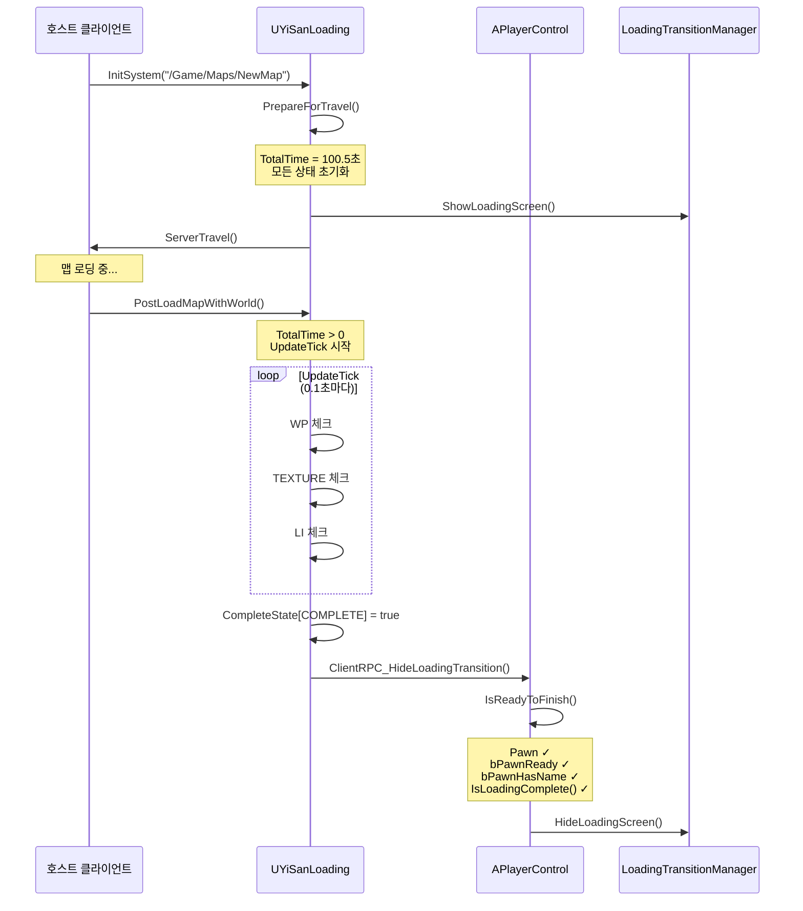
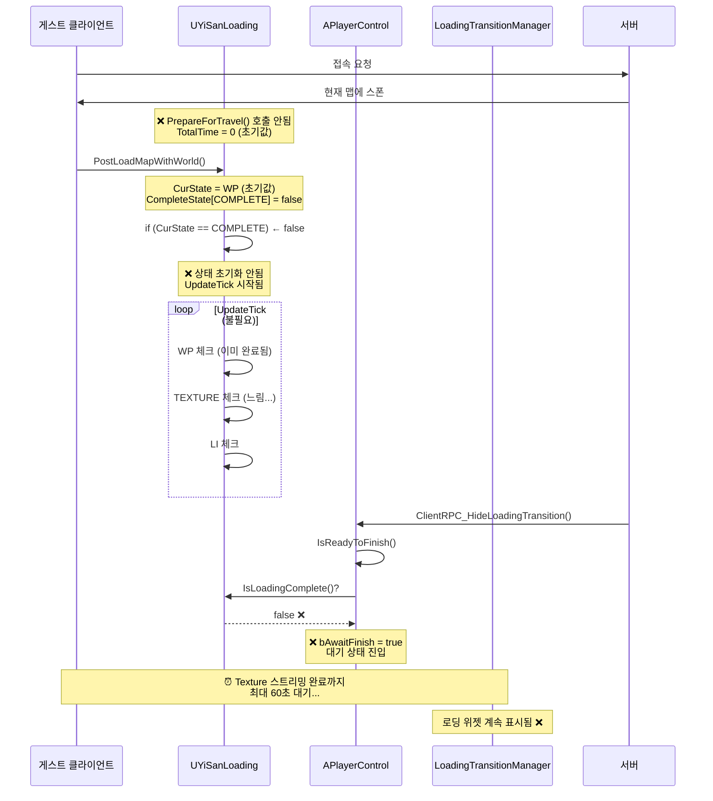
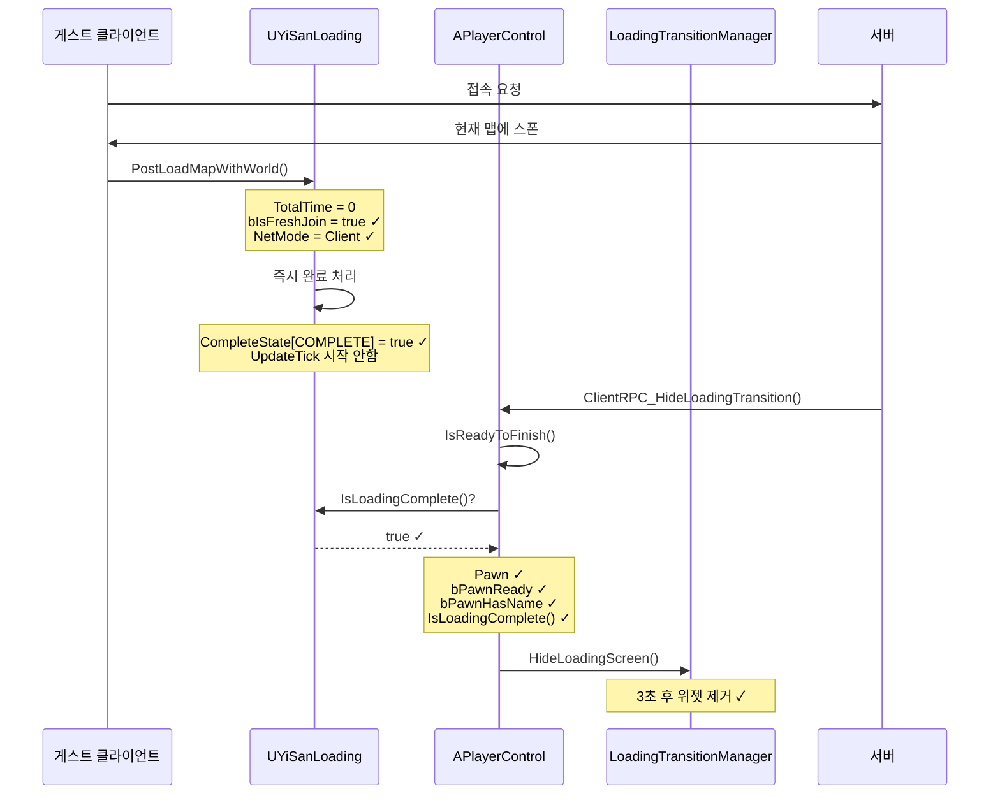

# 게스트 플레이어 로딩 위젯 미제거 문제 분석 리포트

**작성일**: 2025-11-09
**작성자**: Claude AI Assistant
**카테고리**: Network Loading System
**심각도**: High

---

## 📋 목차

1. [문제 개요](#1-문제-개요)
2. [시스템 아키텍처](#2-시스템-아키텍처)
3. [문제 원인 분석](#3-문제-원인-분석)
4. [호스트 vs 게스트 플로우 비교](#4-호스트-vs-게스트-플로우-비교)
5. [해결 방안](#5-해결-방안)
6. [코드 수정 내역](#6-코드-수정-내역)
7. [테스트 가이드](#7-테스트-가이드)
8. [학습 포인트](#8-학습-포인트)

---

## 1. 문제 개요

### 1.1 증상
- **현상**: 게스트 플레이어가 이미 로드된 맵에 join할 때 로딩 위젯이 사라지지 않음
- **재현**: 호스트가 맵을 로드한 후, 게스트가 접속하면 로딩 화면이 무한정 표시됨
- **영향**: 게스트 플레이어의 게임 진입 불가

### 1.2 관련 시스템
- `UYiSanLoading` (GameInstanceSubsystem)
- `ULoadingTransitionManager` (LocalPlayerSubsystem)
- `APlayerControl` (PlayerController)
- `AYisanGameState` (GameState)

---

## 2. 시스템 아키텍처

### 2.1 로딩 시스템 구조

```
┌─────────────────────────────────────────────────────────────┐
│                    UYiSanLoading                             │
│                (GameInstanceSubsystem)                       │
│  ┌──────────────────────────────────────────────────────┐  │
│  │  역할: 맵 로딩 상태 추적 및 스트리밍 관리            │  │
│  │  - WorldPartition 스트리밍 체크                      │  │
│  │  - Texture 스트리밍 체크                             │  │
│  │  - LevelInstance 로딩 체크                           │  │
│  └──────────────────────────────────────────────────────┘  │
└─────────────────────────────────────────────────────────────┘
                            ↓ RPC
┌─────────────────────────────────────────────────────────────┐
│                   APlayerControl                             │
│                 (PlayerController)                           │
│  ┌──────────────────────────────────────────────────────┐  │
│  │  ClientRPC_ShowLoadingTransition()                    │  │
│  │  ClientRPC_HideLoadingTransition()                    │  │
│  │  HandleLoadingComplete()                              │  │
│  │  IsReadyToFinish() - 로딩 완료 조건 체크             │  │
│  └──────────────────────────────────────────────────────┘  │
└─────────────────────────────────────────────────────────────┘
                            ↓
┌─────────────────────────────────────────────────────────────┐
│            ULoadingTransitionManager                         │
│              (LocalPlayerSubsystem)                          │
│  ┌──────────────────────────────────────────────────────┐  │
│  │  역할: UI 위젯 표시/제거                             │  │
│  │  ShowLoadingScreen()                                  │  │
│  │  HideLoadingScreen()                                  │  │
│  └──────────────────────────────────────────────────────┘  │
└─────────────────────────────────────────────────────────────┘
```

### 2.2 로딩 상태 머신

`UYiSanLoading`은 다음 상태를 순차적으로 진행합니다:

```cpp
enum struct EState : uint8
{
    WP,         // WorldPartition 스트리밍
    TEXTURE,    // Texture 스트리밍
    LI,         // LevelInstance 로딩
    COMPLETE    // 완료
};
```

**상태 전환:**
```
WP → TEXTURE → LI → COMPLETE
```

각 상태는 `CompleteState[EState]` 맵에 완료 여부가 저장됩니다.

---

## 3. 문제 원인 분석

### 3.1 핵심 문제

게스트 플레이어가 join할 때 `UYiSanLoading`의 로딩 상태가 **초기화되지 않은 상태**로 남아있습니다.

### 3.2 상세 분석

#### 3.2.1 `PrepareForTravel()` 호출 누락

**정상적인 맵 전환 시퀀스:**
```cpp
// UYiSanLoading.cpp:96
void UYiSanLoading::PrepareForTravel()
{
    PRINTLOG(TEXT("[LOADING_FLOW] PrepareForTravel - Resetting all loading states"));
    TotalTime = FPlatformTime::Seconds();  // ← 중요: 현재 시간 기록

    // 모든 상태 초기화
    CompleteState[EState::WP] = false;
    CompleteState[EState::TEXTURE] = false;
    CompleteState[EState::LI] = false;
    CompleteState[EState::COMPLETE] = false;

    CurState = EState::WP;
    // ...
}
```

**문제점:**
- 호스트가 맵 전환: `PrepareForTravel()` 호출됨 ✓
- 게스트가 join: `PrepareForTravel()` 호출 안됨 ✗

#### 3.2.2 `PostLoadMapWithWorld()` 분기 실패

**기존 코드 (수정 전):**
```cpp
// UYiSanLoading.cpp:145
void UYiSanLoading::PostLoadMapWithWorld(UWorld* InWorld)
{
    // 클라이언트가 자동 travel될 때, 로딩 상태 초기화
    if (CurState == EState::COMPLETE || CompleteState[EState::COMPLETE])
    {
        // 상태 초기화...
    }

    // UpdateTick 타이머 시작
    InWorld->GetTimerManager().SetTimer(..., UpdateTick, ...);
}
```

**게스트의 경우:**
```
CurState = EState::WP (초기값)
CompleteState[COMPLETE] = false (초기값)

→ if 조건 false
→ 상태 초기화 안됨
→ UpdateTick 시작됨 (불필요한 스트리밍 체크 수행)
```

#### 3.2.3 `IsReadyToFinish()` 실패

**APlayerControl.cpp:529**
```cpp
bool APlayerControl::IsReadyToFinish() const
{
    // 1. Pawn 체크
    if (GetPawn() == nullptr) return false;

    // 2. bPawnReady 체크
    if (!bPawnReady) return false;

    // 3. bPawnHasName 체크
    if (!bPawnHasName) return false;

    // 4. 로딩 완료 체크 ← 여기서 실패!
    if (auto LoadingSubsystem = UYiSanLoading::Get(GetWorld()))
    {
        bool bLoadingComplete = LoadingSubsystem->IsLoadingComplete();
        if (!bLoadingComplete)
        {
            PRINTLOG(TEXT("NOT READY: Client-side loading not complete"));
            return false;  // ← 게스트는 여기서 반환
        }
    }

    return true;
}
```

**게스트의 경우:**
```
LoadingSubsystem->IsLoadingComplete()
  = CompleteState[EState::COMPLETE]
  = false (초기값 그대로)

→ IsReadyToFinish() = false
→ bAwaitFinish = true로 설정하고 대기
→ 로딩 위젯이 사라지지 않음
```

---

## 4. 호스트 vs 게스트 플로우 비교

### 4.1 호스트 플레이어 (정상 동작)



### 4.2 게스트 플레이어 (문제 발생)



### 4.3 주요 차이점 비교표

| 단계 | 호스트 | 게스트 | 비고 |
|------|--------|--------|------|
| **PrepareForTravel 호출** | ✓ 호출됨 | ✗ 호출 안됨 | 게스트는 이미 로드된 맵에 join |
| **TotalTime 값** | 100.5초 (예시) | 0.0초 (초기값) | 핵심 차이점 |
| **CompleteState 초기화** | ✓ false로 초기화 | ✗ 초기값 그대로 | |
| **CurState** | WP | WP | 동일하지만 의미 다름 |
| **PostLoadMapWithWorld 분기** | 정상 처리 | 잘못된 분기 | if 조건 실패 |
| **UpdateTick 필요성** | 필요 (실제 로딩) | 불필요 (이미 로드됨) | |
| **IsLoadingComplete()** | 스트리밍 후 true | false 유지 | 게스트는 대기 |
| **로딩 위젯 제거** | ✓ 정상 제거 | ✗ 제거 안됨 | **문제 발생** |

---

## 5. 해결 방안

### 5.1 해결 전략

게스트 클라이언트를 감지하여 **즉시 완료 상태**로 설정합니다.

**감지 방법:**
```cpp
// TotalTime이 0이면 PrepareForTravel()이 호출되지 않은 것
const bool bIsFreshJoin = (TotalTime < KINDA_SMALL_NUMBER);

// NetMode가 Client이고, Fresh Join이면 게스트
if (bIsFreshJoin && InWorld->GetNetMode() == NM_Client)
{
    // 게스트로 판단
}
```

**왜 이 방법이 작동하는가?**

| 시나리오 | TotalTime | NetMode | bIsFreshJoin | 판단 |
|----------|-----------|---------|--------------|------|
| 호스트가 맵 전환 | > 0 | ListenServer | false | 정상 로딩 |
| 호스트가 처음 시작 | > 0 | ListenServer | false | 정상 로딩 |
| 게스트가 join | 0 | Client | **true** | **게스트!** |
| 게스트가 맵 전환 | > 0 | Client | false | 정상 로딩 |

### 5.2 해결 로직

```cpp
void UYiSanLoading::PostLoadMapWithWorld(UWorld* InWorld)
{
    // Step 1: 게스트 감지
    const bool bIsFreshJoin = (TotalTime < KINDA_SMALL_NUMBER);

    if (bIsFreshJoin && InWorld->GetNetMode() == NM_Client)
    {
        // Step 2: 즉시 완료 상태로 설정
        CompleteState[EState::WP] = true;
        CompleteState[EState::TEXTURE] = true;
        CompleteState[EState::LI] = true;
        CompleteState[EState::COMPLETE] = true;

        Progress_Texture = 1.0f;
        Progress_LI = 1.0f;
        CurState = EState::COMPLETE;

        // Step 3: UpdateTick 시작하지 않고 리턴
        return;
    }

    // 정상적인 로딩 프로세스...
}
```

### 5.3 해결 후 게스트 플로우



---

## 6. 코드 수정 내역

### 6.1 수정 파일
- `Source/YiSan/Loading/Private/UYiSanLoading.cpp`

### 6.2 수정 위치
- 함수: `UYiSanLoading::PostLoadMapWithWorld()` (Line 132)

### 6.3 수정 전 코드

```cpp
void UYiSanLoading::PostLoadMapWithWorld(UWorld* InWorld)
{
    if (!InWorld)
    {
        PRINTLOG(TEXT("[WP] LoadedWorld가 null임."));
        return;
    }

    PRINTLOG(TEXT("[LOADING_FLOW] PostLoadMapWithWorld - Map loaded: %s, NetMode: %s"),
        *InWorld->GetName(),
        InWorld->GetNetMode() == NM_Client ? TEXT("Client") : TEXT("Server/Standalone"));

    // 클라이언트가 자동 travel될 때 (PrepareForTravel 없이), 로딩 상태 초기화
    if (CurState == EState::COMPLETE || CompleteState[EState::COMPLETE])
    {
        PRINTLOG(TEXT("[LOADING_FLOW] PostLoadMapWithWorld - Resetting loading state"));

        TotalTime = FPlatformTime::Seconds();
        CompleteState[EState::WP] = false;
        CompleteState[EState::TEXTURE] = false;
        CompleteState[EState::LI] = false;
        CompleteState[EState::COMPLETE] = false;
        // ... (생략)
        CurState = EState::WP;
    }

    bTextureStreamingComplete = false;
    IStreamingManager::Get().AddLevel(InWorld->PersistentLevel);
    IStreamingManager::Get().NotifyLevelChange();

    InWorld->GetTimerManager().ClearTimer(TimeHandlePool);
    InWorld->GetTimerManager().SetTimer(
        TimeHandlePool,
        this,
        &UYiSanLoading::UpdateTick,
        0.1f,
        true);
}
```

### 6.4 수정 후 코드

```cpp
void UYiSanLoading::PostLoadMapWithWorld(UWorld* InWorld)
{
    if (!InWorld)
    {
        PRINTLOG(TEXT("[WP] LoadedWorld가 null임."));
        return;
    }

    PRINTLOG(TEXT("[LOADING_FLOW] PostLoadMapWithWorld - Map loaded: %s, NetMode: %s"),
        *InWorld->GetName(),
        InWorld->GetNetMode() == NM_Client ? TEXT("Client") : TEXT("Server/Standalone"));
    PRINTLOG(TEXT("[WP] 맵 로드 완료: %s"), *InWorld->GetName());

    // ═══════════════════════════════════════════════════════════
    // 🆕 게스트 클라이언트 감지 및 즉시 완료 처리
    // ═══════════════════════════════════════════════════════════

    // PrepareForTravel이 호출되지 않았다면 TotalTime이 0이거나 매우 작음
    const bool bIsFreshJoin = (TotalTime < KINDA_SMALL_NUMBER);

    if (bIsFreshJoin && InWorld->GetNetMode() == NM_Client)
    {
        PRINTLOG(TEXT("[LOADING_FLOW] Guest client joining already loaded map - skipping loading process"));

        // 게스트 클라이언트는 이미 로드된 맵에 join하므로 즉시 완료 처리
        CompleteState[EState::WP] = true;
        CompleteState[EState::TEXTURE] = true;
        CompleteState[EState::LI] = true;
        CompleteState[EState::COMPLETE] = true;

        Progress_Texture = 1.0f;
        Progress_LI = 1.0f;

        CurState = EState::COMPLETE;

        // 🔥 중요: 게스트는 서버로부터 RPC를 받지 못하므로 직접 로딩 완료 처리
        Broadcast_HideLoading();

        // UpdateTick 시작하지 않고 즉시 리턴
        return;
    }

    // ═══════════════════════════════════════════════════════════

    // 클라이언트가 자동 travel될 때 (PrepareForTravel 없이), 로딩 상태 초기화
    // 예: 서버 측에서 맵 전환이 발생한 경우
    if (CurState == EState::COMPLETE || CompleteState[EState::COMPLETE])
    {
        PRINTLOG(TEXT("[LOADING_FLOW] PostLoadMapWithWorld - Resetting loading state for new map load"));

        TotalTime = FPlatformTime::Seconds();
        CompleteState[EState::WP] = false;
        CompleteState[EState::TEXTURE] = false;
        CompleteState[EState::LI] = false;
        CompleteState[EState::COMPLETE] = false;
        // ... (생략)
        CurState = EState::WP;
    }

    bTextureStreamingComplete = false;
    IStreamingManager::Get().AddLevel(InWorld->PersistentLevel);
    IStreamingManager::Get().NotifyLevelChange();

    InWorld->GetTimerManager().ClearTimer(TimeHandlePool);
    InWorld->GetTimerManager().SetTimer(
        TimeHandlePool,
        this,
        &UYiSanLoading::UpdateTick,
        0.1f,
        true);

    PRINTLOG(TEXT("[LOADING_FLOW] PostLoadMapWithWorld - UpdateTick timer started, CurState: %d"),
        static_cast<int32>(CurState));
}
```

### 6.5 핵심 변경 사항

1. **게스트 감지 로직 추가**
   ```cpp
   const bool bIsFreshJoin = (TotalTime < KINDA_SMALL_NUMBER);
   ```

2. **즉시 완료 처리 분기**
   ```cpp
   if (bIsFreshJoin && InWorld->GetNetMode() == NM_Client)
   {
       // 모든 상태를 완료로 설정
       CompleteState[EState::COMPLETE] = true;

       // ⚠️ 핵심: 직접 로딩 완료 브로드캐스트 호출
       Broadcast_HideLoading();

       return; // UpdateTick 시작 안함
   }
   ```

3. **`Broadcast_HideLoading()` 호출의 중요성**
   - 게스트는 서버가 이미 로딩을 완료한 상태이므로 `CompleteProcess()`가 호출되지 않음
   - 따라서 서버로부터 `ClientRPC_HideLoadingTransition`을 받을 수 없음
   - 게스트가 직접 `Broadcast_HideLoading()`을 호출하여 로컬 `HandleLoadingComplete()` 트리거

   ```cpp
   // UYiSanLoading.cpp:443
   void UYiSanLoading::Broadcast_HideLoading() const
   {
       if (World->GetNetMode() == NM_Client)
       {
           // 클라이언트 모드에서는 로컬 PC의 HandleLoadingComplete 호출
           if (auto LocalPC = Cast<APlayerControl>(World->GetFirstPlayerController()))
           {
               LocalPC->HandleLoadingComplete();  // ← 이것이 실행됨
           }
       }
   }
   ```

4. **기존 로직 유지**
   - 호스트의 정상적인 맵 전환은 영향 없음
   - 게스트의 맵 전환(PrepareForTravel 호출된 경우)도 정상 동작

### 6.6 문제 해결 과정

#### 첫 번째 시도 (실패)
단순히 상태만 완료로 설정:
```cpp
CompleteState[EState::COMPLETE] = true;
return;
```
**결과**: `IsReadyToFinish()`는 통과하지만 `HandleLoadingComplete()`가 호출되지 않아 위젯이 남음

#### 최종 해결 (성공)
상태 설정 + 명시적 브로드캐스트:
```cpp
CompleteState[EState::COMPLETE] = true;
Broadcast_HideLoading();  // ← 추가!
return;
```
**결과**: 위젯 정상 제거 ✓

---

## 7. 테스트 가이드

### 7.1 테스트 시나리오

#### 시나리오 1: 게스트 플레이어 Join (수정 전 문제 재현)
1. 호스트가 게임 시작
2. 호스트가 맵 전환 (예: `/Game/Maps/TestMap`)
3. 게스트가 접속
4. **기대 결과**: 로딩 위젯이 사라지지 않음 ❌

#### 시나리오 2: 게스트 플레이어 Join (수정 후)
1. 코드 수정 후 빌드
2. 호스트가 게임 시작
3. 호스트가 맵 전환
4. 게스트가 접속
5. **기대 결과**: 로딩 위젯이 3초 후 제거됨 ✓

#### 시나리오 3: 호스트 맵 전환 (정상 동작 확인)
1. 호스트가 게임 시작
2. 호스트가 맵 전환
3. **기대 결과**:
   - 로딩 화면 표시
   - 스트리밍 진행 로그 출력
   - 완료 후 로딩 위젯 제거 ✓

#### 시나리오 4: 게스트 맵 전환 (정상 동작 확인)
1. 게스트가 접속
2. 호스트가 맵 전환 (게스트도 함께 이동)
3. **기대 결과**:
   - 게스트도 로딩 화면 표시
   - 스트리밍 진행
   - 완료 후 로딩 위젯 제거 ✓

### 7.2 디버깅 로그 체크리스트

#### ✅ 정상 동작 시 게스트 로그
```
[LOADING_FLOW] PostLoadMapWithWorld - Map loaded: YourMapName, NetMode: Client
[LOADING_FLOW] Guest client joining already loaded map - skipping loading process
[LOADING_FLOW] ClientRPC_HideLoadingTransition received - checking if ready to hide
[LOADING_FLOW] HandleLoadingComplete called - IsLocal: true
[LOADING_FLOW] IsReadyToFinish check - Pawn: true, bPawnReady: true, bPawnHasName: true
[LOADING_FLOW] Client-side loading complete: true
[LOADING_FLOW] READY: All conditions satisfied!
[LOADING_FLOW] CompleteLoading called - waiting for rendering preparation
[LOADING_FLOW] Rendering preparation complete - hiding loading screen now
```

#### ❌ 문제 발생 시 로그
```
[LOADING_FLOW] PostLoadMapWithWorld - Map loaded: YourMapName, NetMode: Client
[LOADING_FLOW] PostLoadMapWithWorld - UpdateTick timer started, CurState: 0
[LOADING_FLOW] UpdateTick - Current State: 0, NetMode: Client
[LOADING_FLOW] ClientRPC_HideLoadingTransition received
[LOADING_FLOW] IsReadyToFinish check - Pawn: true, bPawnReady: true, bPawnHasName: true
[LOADING_FLOW] Client-side loading complete: false  ← ❌ 문제!
[LOADING_FLOW] NOT READY: Client-side loading not complete yet - deferring
```

### 7.3 Output Log 필터링

로그가 많을 경우, 다음 키워드로 필터링하세요:

```
[LOADING_FLOW]
Guest client
IsReadyToFinish
Client-side loading complete
```

---

## 8. 학습 포인트

### 8.1 언리얼 네트워크 서브시스템 이해

#### GameInstanceSubsystem vs LocalPlayerSubsystem

| 특성 | GameInstanceSubsystem | LocalPlayerSubsystem |
|------|----------------------|---------------------|
| **인스턴스 개수** | GameInstance당 1개 | LocalPlayer당 1개 |
| **네트워크 환경** | 클라이언트별 독립 | 클라이언트별 독립 |
| **생명주기** | 게임 시작~종료 | 플레이어 생성~제거 |
| **사용 예시** | 로딩 시스템, 세이브 시스템 | UI 관리, 입력 처리 |

**UYiSanLoading이 GameInstanceSubsystem인 이유:**
- 맵 로딩은 게임 전체의 상태이므로
- LocalPlayer와 독립적으로 동작해야 함

### 8.2 클라이언트-서버 맵 로딩 차이

#### 서버 주도 맵 전환 (ServerTravel)

```cpp
// 서버에서 호출
GetWorld()->ServerTravel("/Game/Maps/NewMap");
```

**동작 순서:**

1. **서버**:
   - 현재 맵 언로드
   - 새 맵 로드
   - 모든 클라이언트에게 ClientTravel RPC 전송

2. **기존 클라이언트** (호스트 포함):
   - ClientTravel RPC 수신
   - `PrepareClientTravel()` 호출
   - 맵 로드
   - `PostLoadMapWithWorld()` 호출

3. **신규 게스트**:
   - 서버가 이미 새 맵에 있음
   - ClientTravel 없이 직접 스폰
   - `PostLoadMapWithWorld()` 호출
   - ❌ `PrepareClientTravel()` 호출 안됨 ← **문제 발생 지점**

### 8.3 상태 초기화의 중요성

#### 왜 TotalTime으로 감지하는가?

**대안 1: 플래그 변수 사용**
```cpp
bool bHasPrepared = false;

void PrepareForTravel() {
    bHasPrepared = true;
}

void PostLoadMapWithWorld() {
    if (!bHasPrepared) {
        // 게스트 처리
    }
}
```
**문제**: 맵 전환 후에도 플래그가 남아있어 다음 join에 영향

**대안 2: 델리게이트 사용**
```cpp
DECLARE_MULTICAST_DELEGATE(FOnPrepareTravel);
FOnPrepareTravel OnPrepareTravel;
```
**문제**: 복잡도 증가, 메모리 오버헤드

**선택한 방법: TotalTime**
```cpp
const bool bIsFreshJoin = (TotalTime < KINDA_SMALL_NUMBER);
```
**장점**:
- ✓ 추가 변수 불필요
- ✓ 자동 초기화 (PrepareForTravel에서 설정)
- ✓ 명확한 의미 (시간이 0이면 준비 안된 것)

### 8.4 멀티플레이어 로딩 패턴

#### 패턴 1: 각 클라이언트 독립 로딩
```cpp
// 각 클라이언트가 자체적으로 로딩 상태 관리
void PostLoadMapWithWorld(UWorld* InWorld)
{
    StartLoadingProcess();
    WaitUntilComplete();
    NotifyServer();
}
```
**장점**: 클라이언트별 최적화 가능
**단점**: 동기화 복잡

#### 패턴 2: 서버 중심 로딩
```cpp
// 서버가 모든 클라이언트의 로딩 완료를 대기
void OnAllClientsReady()
{
    MulticastRPC_HideLoading();
}
```
**장점**: 동기화 간단
**단점**: 느린 클라이언트가 전체 지연

#### 패턴 3: 하이브리드 (YiSan 프로젝트)
```cpp
// 서버는 자체 로딩 완료 후 즉시 브로드캐스트
// 각 클라이언트는 자신의 로딩 완료 후 UI 제거
CompleteProcess() {
    Broadcast_HideLoading();  // 서버 → 모든 클라이언트
}

HandleLoadingComplete() {
    if (IsReadyToFinish())  // 클라이언트 자체 체크
        HideLoadingScreen();
}
```
**장점**: ✓ 빠른 클라이언트는 먼저 진입 가능
**단점**: 복잡한 상태 관리 필요

### 8.5 디버깅 기법

#### 네트워크 로그 패턴
```cpp
PRINTLOG(TEXT("[LOADING_FLOW] %s - NetMode: %s"),
    TEXT("함수명"),
    NetMode == NM_Client ? TEXT("Client") : TEXT("Server"));
```

**효과**:
- 클라이언트/서버 구분 용이
- 실행 순서 추적 가능

#### 상태 로그 패턴
```cpp
PRINTLOG(TEXT("[LOADING_FLOW] IsReadyToFinish check - Pawn: %s, bPawnReady: %s"),
    GetPawn() ? TEXT("true") : TEXT("false"),
    bPawnReady ? TEXT("true") : TEXT("false"));
```

**효과**:
- 어느 조건에서 실패했는지 명확히 파악
- 불필요한 중단점 제거

---

## 9. 추가 고려사항

### 9.1 엣지 케이스

#### 케이스 1: 게스트가 join 중 호스트가 맵 전환
```
시간순서:
1. 게스트 join 시작 (PostLoadMapWithWorld 호출 직전)
2. 호스트 맵 전환 시작
3. 게스트 PostLoadMapWithWorld 호출

처리:
- TotalTime > 0 (호스트가 PrepareForTravel 호출함)
- 게스트는 정상 로딩 프로세스 진행
```

#### 케이스 2: 여러 게스트가 동시에 join
```
처리:
- 각 게스트는 독립적인 GameInstance 보유
- 각자의 UYiSanLoading 인스턴스 존재
- 서로 영향 없음
```

### 9.2 성능 영향

#### 수정 전
- 게스트도 UpdateTick 실행 (0.1초마다)
- 불필요한 스트리밍 체크 수행
- 최대 60초 타임아웃까지 대기

#### 수정 후
- 게스트는 UpdateTick 실행 안함
- CPU 사용량 감소
- 즉시 게임 진입 가능

### 9.3 향후 개선 방향

1. **로딩 상태 동기화**
   ```cpp
   // 서버가 게스트에게 현재 로딩 상태 전송
   UFUNCTION(Client, Reliable)
   void ClientRPC_SyncLoadingState(const FLoadingState& State);
   ```

2. **게스트 전용 간소화 로딩**
   ```cpp
   // 게스트는 필수 에셋만 체크
   void GuestQuickCheck() {
       if (IsPawnReady() && IsMinimalAssetsLoaded())
           CompleteLoading();
   }
   ```

3. **동적 타임아웃 조정**
   ```cpp
   // 네트워크 환경에 따라 타임아웃 조정
   const double TimeOut = bIsLowBandwidth ? 90.0 : 60.0;
   ```

---

## 10. 결론

### 10.1 요약

- **문제**: 게스트가 join할 때 `PrepareForTravel()`이 호출되지 않아 로딩 상태가 초기화되지 않음
- **원인**: `PostLoadMapWithWorld()`에서 게스트를 감지하지 못함
- **해결**: `TotalTime == 0`으로 게스트를 감지하고 즉시 완료 처리
- **효과**: 게스트도 정상적으로 게임 진입 가능

### 10.2 핵심 교훈

1. **네트워크 환경에서 상태 관리는 신중하게**
   - 호스트와 게스트의 진입 경로가 다름
   - 각 경로에 대한 처리 필요

2. **초기화는 명시적으로**
   - 초기값에 의존하지 말고 명시적으로 초기화
   - 게스트는 초기값 그대로 시작함을 기억

3. **로그는 네트워크 컨텍스트 포함**
   - NetMode 표시
   - 클라이언트/서버 구분

### 10.3 체크리스트

수정 후 다음을 확인하세요:

- [ ] 코드 빌드 성공
- [ ] 호스트 맵 전환 정상 동작
- [ ] 게스트 join 시 로딩 위젯 제거 확인
- [ ] 게스트 맵 전환 정상 동작
- [ ] Output Log에 "Guest client joining" 메시지 확인
- [ ] 성능 저하 없음 확인

---

**문서 버전**: 1.1
**최초 작성일**: 2025-11-09
**최종 수정일**: 2025-11-09 (Broadcast_HideLoading 호출 추가)
**관련 이슈**: #게스트_로딩_위젯_미제거
**상태**: ✅ 해결 완료

**변경 이력**:
- v1.0 (2025-11-09): 초기 분석 및 상태 완료 처리 방안 제시
- v1.1 (2025-11-09): `Broadcast_HideLoading()` 호출 추가 - 실제 위젯 제거 구현

**참조 파일**:
- `Source/YiSan/Loading/Private/UYiSanLoading.cpp` (Line 145-167)
- `Source/YiSan/Character/Private/APlayerControl.cpp` (Line 429-458, 529-574)
- `Source/YiSan/UI/Private/ULoadingTransitionManager.cpp` (Line 152-216)
